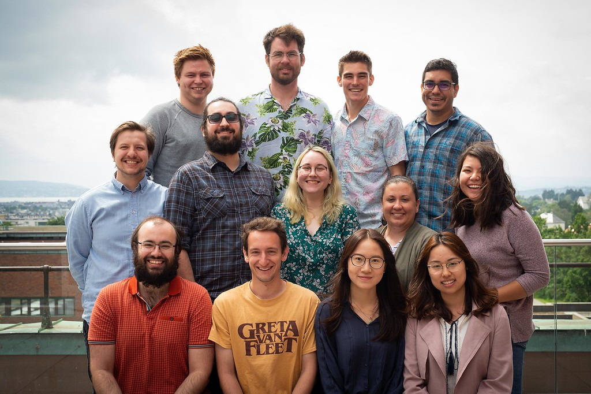

## Current

#### Prof. Danny Caballero (Principal Investigator, MSU)

 Danny is an Associate Professor in the [Department of Physics and Astronomy](https://pa.msu.edu) and the [Department of Computational Mathematics, Science and Engineering](https://cmse.msu.edu). He holds the Lappan-Phillips Chair of Physics Education, co-directs the [Physics Education Research Lab](https://perl.natsci.msu.edu), and is the principal investigator of the [Learning Machines Lab](https://learningmachineslab.github.io). He earn his Bachelor's degree in physics from the [University of Texas at Austin](https://ph.utexas.edu), and his Master's and PhD in physics from the [Georgia Institute of Technology](https://physics.gatech.edu). Danny worked as a Science Teaching Postdoctoral Fellow at the [University of Colorado Boulder](https://www.colorado.edu/physics) before joining the faculty at Michigan State. His research focuses on computational education and the use of data science to address questions in STEM education. In his free time, he bikes, skateboards, and barbecues. His website can be found [here](https://dannycab.github.io/).

#### Prof. Rachel Henderson (Principal Investigator, MSU)


Rachel is an Assistant Professor in the [Department of Physics and Astronomy](https://pa.msu.edu/) and the [CREATE for STEM Institute](https://create4stem.msu.edu/) at MSU. She earned her Bachelor's degree in physics from [Slippery Rock University in Pennsylvania](https://www.sru.edu/academics/majors-and-minors/physics) and her Master's and PhD in physics from [West Virginia University](https://physics.wvu.edu/). Rachel was a former post-doctoral researcher working with Danny in the [Physics Education Research Lab (PERL)](https://perl.natsci.msu.edu/) before joining the faculty at Michigan State. Her research focuses on developing and implementing inclusive and equitable assessment tools that can be used to improve learning for all students within the physics classroom. In her free time, she likes to go to local restaurants and try the local favorite. Her website can be found [here](https://rachelhenderson.info/).

#### John Aiken (PhD Student, UiO)

This is John!

#### Alyssa Waterson (PhD Student, MSU)

This is Alyssa!

#### Nick Young (PhD Student, MSU)

This is Nick!

#### Nils Mikkelsen (Undergraduate Researcher, UiO)

This is Nils!

#### Nicole Verboncoeur (Undergraduate Researcher, MSU)

This is Nicole!

## Alumni

* Gabriel Sigurd Cabrera (UiO)
* Lucas Charpentier (UiO)
* Matt Ring (MSU)
* Robert Solli (UiO)
* Anne Wang (Texas A&M)
* Joe Wilson (CU-Boulder)
* Zhen (Jenn) Xu (Beijing Normal)
* Linrui (Rachel) Zhang (Beijing Normal)

### The 2019 Learning Machines Lab Summer Internship group!

**Across the top:** Nils, John (leader), Matt, Danny (leader)

**Middle row:** Robert (leader), Gabriel, Alyssa, Rachel (leader), Anne

**Front row:** Lucas, Joe, Jenn, Rachel
